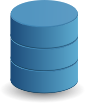

# Hi, I’m Diyorbek 👋

<!-- - 🌱 I’m currently learning Django framework -->

<!---
- 👀 I’m interested in ...
- 💞️ I’m looking to collaborate on ...
- 📫 How to reach me ...
--->

## My Skills

### Languages, Frameworks and Libraries
*  **Python**
  -  **Django framework**
  -  **Flask micro-framework**

*  **JavaScript**
  -  **jQuery**

*  - **Databases**
  -  **PostgreSQL**

### Tools
*  **Docker**
*  **Postman** (API testing)
*  **Git** (Version Control)
